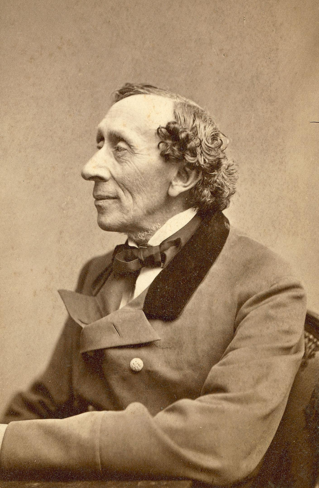

<param ve-config style="article">

## Hans Christian Andersen (1805-1875)
**Places:** Gads Hill, Rochester. Knowle House, Sevenoaks. Chevening Church.

>“Often, when we approached Rochester, the upper parts of the wide-stretching town lay shrouded in the morning mist; then the mist lifted, and forth stood the picturesque old castle ruins, with their ivied walls, and the massive Gothic cathedral. [..] It usually happened to be low tide; the ships lay on their sides, like dead fish, on the slimy ground.”

{: .right}

Andersen visited [Charles Dickens](dickens/dickens-biography) at his [Gads Hill](dickens/dickens-gads-hill) home in 1857, extending his intended fortnight stay to five weeks and famously outstaying his welcome. Andersen appears to have enjoyed his stay in Kent immensely and is beguiled by the “hedges of wild-rose and honeysuckle in full bloom” and the “neat and clean and comfortable” abodes he sees on his walk from the railway station to Dickens’s home. Gads Hill is equally charming to Andersen, “a model of comfort and holiday brightness” set in glorious countryside. Andersen wastes no time In leading the Dickens’ family out on walks, the family having been resident in Gads Hill only two weeks before Andersen arrives, and his descriptions of the pastoral bliss are overshadowed only by his obvious adoration of Dickens.

Andersen had apparently visited Kent before, staying with Dickens’s publisher Richard Bentley in Sevenoaks and visiting Knowle House and Chevening Church. Bentley describes Andersen’s love of “the glorious sylvan scenery” surrounding his house, prized above the man-made architecture of the church. Bentley’s description, included in Andersen’s recollections, portrays Andersen as a thoughtful man of simple pleasures, at odds with the descriptions of Andersen as eccentric and awkward which characterise Dickens’s own letters. The Dickens Museum at Gad’s Hill Place  features a note pinned to the wall declaring Hans (Christian) Andersen slept in this room for five weeks – which seemed to the family AGES! 

## References:
Andersen, Hans Christian. "A visit to Charles Dickens." _The Eclectic Magazine of Foreign Literature_ (1844-1898) 02 1871: 183. ProQuest.   
[Dickens Museum Blog](https://dickensmuseum.com/blogs/charles-dickens-museum/hans-christian-andersen-the-eccentric-guest)  

