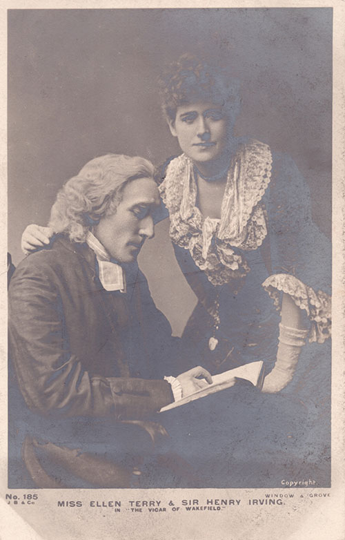

<param ve-config style="article">

## Dame (Alice) Ellen Terry (27 February 1847 – 21 July 1928)

*Place:* Small Hythe [^ref1]

{: .right .dropshadow}

Ellen Terry was the superstar English actress of the Victorian period. Born to a theatrical family, she first trod the boards aged eight in the part of Mamillius in The Winter’s Tale. She is best known for her long theatrical partnership with Sir Henry Irving, performing at the Lyceum Theatre, London, and throughout the UK and the US. 

She is also known for her series of highly-acclaimed lectures about Shakespeare’s women (and the book that resulted – Four Lectures on Shakespeare – written by Ellen Terry and edited by her ‘literary henchman’ [Christopher St John](20c/st-john-biography) ).

In 1900, she bought her last home, Smallhythe Place, a Tudor farmhouse in the Kent marshes outside Tenterden, as a retreat from her busy London theatrical life. Terry’s biographer, Nina Auerbach, called it ‘a pocket of eerie stillness in the Kentish countryside’. [^ref2]
 

Ellen Terry wrote of her new home: ‘It’s pretty rough at the Farmhouse! ‘The simple life’ indeed! But at least there’s a jolly big Bath there.’ [^ref3]

She gifted the adjacent ‘Priest’s House’ to her daughter, Edith [‘Edy’ Craig](20c-craig-biography), who lived in it with her life partners – the writer [Christopher St John](20c-st-john-biography) (Christabel Marshall), and after 1916 with St John and the artist, Clare ‘Tony’ Atwood. 

Ellen Terry wrote about life with Edy at Smallhythe Place (then called The Farm) in a letter to George Bernard Shaw (14 June 1904), ‘Edy is here. Did I tell you she is my right hand, and still growing to be my left hand, and happy as a sandboy all the while? I fear to be too happy in her – I try to very quiet with it all. She has a cottage of her own here and we visit each other every day!’ [^ref4]

[Christopher St John](/20c-st-john-biography) characterised her early life with Ellen Terry and [Edy Craig]((20c-craig-biography) at Smallhythe as ‘a lovely pleasant carefree existence’. They created beautiful gardens, went on moonlight drives to Bodiam Castle, and took the occasional pleasure cruise across the English Channel to Bruges.  

[St John](/20c-st-john-biography) wrote that the many ‘monuments’ to Ellen Terry –  her autobiography, letters, and lectures on Shakespeare ‘as well as her shrine at Smallhythe’ – were ‘something to inspire those who come after us with the same devotion to her memory.’ [^ref5]

**Article written by:** Carla Danella

[^ref1]: Smallhythe Place is in the hamlet of Small Hythe in Kent. Note that some authors quoted refer to the hamlet as Small Hythe and Smallhythe interchangeably. 

[^ref2]: Auerbach 395.

[^ref3]: Auerbach 149.

[^ref4]: ET to GBS, Letter CCLXII, 14 June 1904, from what was then still called The Farm, Small Hythe rather than Smallhythe Place. Ellen Terry and George Bernard Shaw: A Correspondence 373.

[^ref5]: St John, 354.

### Bibliography:

Auerbach, Nina (1987) _Ellen Terry, Player in Her Time._ Phoenix House, J. M. Dent & Sons Ltd.  

Holroyd, M. (2009) _A Strange Eventful History: The Dramatic Lives of Ellen Terry, Henry Irving and their Remarkable Families._ Vintage Books. 
St John, C. (1931) (ed.) _Ellen Terry and George Bernard Shaw: A Correspondence._ Max Reinhardt. 

St John, C. (1933) (ed.) _Ellen Terry's Memoirs._ Victor Gollancz Ltd.

