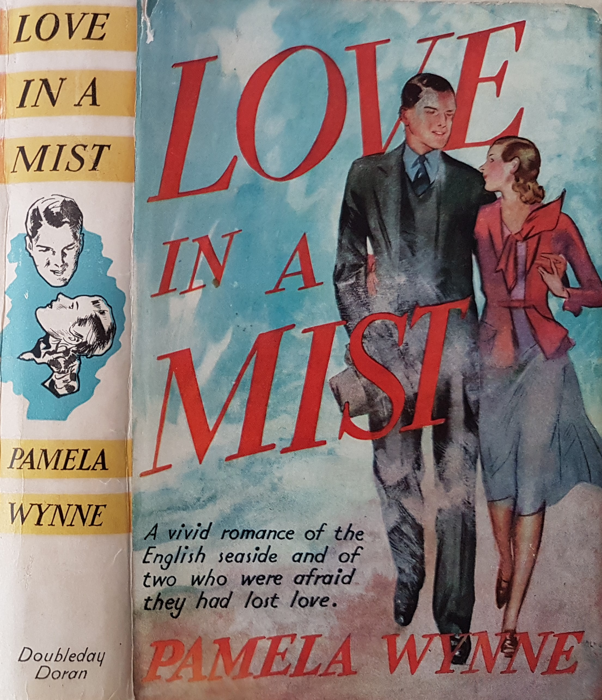

## Pamela Wynne (Winifred Mary Scott, née Watson) 1879-1959

**Places:** Margate, Sissinghurst 

>‘Margate is a place that grows on you. You arrive at it feeling vaguely contemptuous, and ready, if by any far distant chance you should meet anyone that you know, to explain that it is your first visit, and that you only came because your doctor so strongly recommended it. And then, after getting to feel steadily better and better, and more and more alive, and as if life still held something for you, you get to love it. Especially if you go there in May.’
	_Love in a Mist_, 1932

{: .right}

Both romance and crime fiction flourished in the 1930s holiday market, and Margate on the 
East coast of Kent provided an obvious setting for middlebrow fiction. Set in the years after 
WW1, Pamela Wynne’s _Love in a Mist_ gives a picture of Margate as it appears to a range of 
observers, from a shell-shocked author who is sent there to recover his mental balance to his 
taciturn servant, who remembers his childhood holidays in the town. For Pauline Russell though 
it is the scene of her domestic drudgery, where she cooks and cleans as well as looking after her 
demanding husband, himself a war invalid. Her perspective as a resident and married woman is 
markedly different from the detached attitude of the London detective offered by crime 
authors such as Milward Kennedy at the same period. 

Pamela Wynne died on the other side of the county at her son’s house, Mill Cottage in Sissinghurst, in 1959. Her estate amounted to just over £33,625, suggesting that her writing was still attracting a significant audience.

**Article written by:** Carolyn Oulton

### Bibliography 
'’Deaths'’. 18 March 1959. _The Times_. GALE|CS202726514.   
[Pamela Wynne, 20th Century Novelist](https://pamela-wynne.webs.com/biography.htm)   

Principal Probate Registry. Calendar of the Grants of Probate and Letters of Administration made in the Probate Registries of the High Court of Justice in England. London, England © Crown copyright.
Ancestry.com. England & Wales, National Probate Calendar (Index of Wills and Administrations), 1858-1995.

Wynne, Pamela. _Love in a Mist_. London: Philip Allen & Co., 1932.

<!--stackedit_data:
eyJoaXN0b3J5IjpbMTMzMzY2NDk2XX0=
-->
