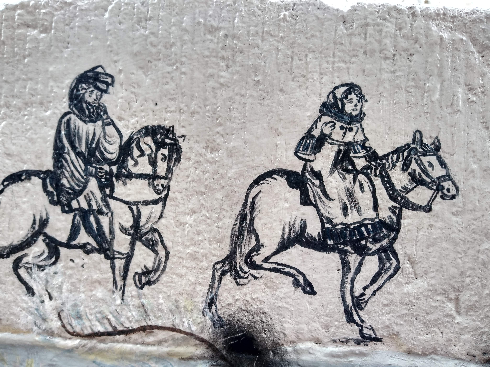
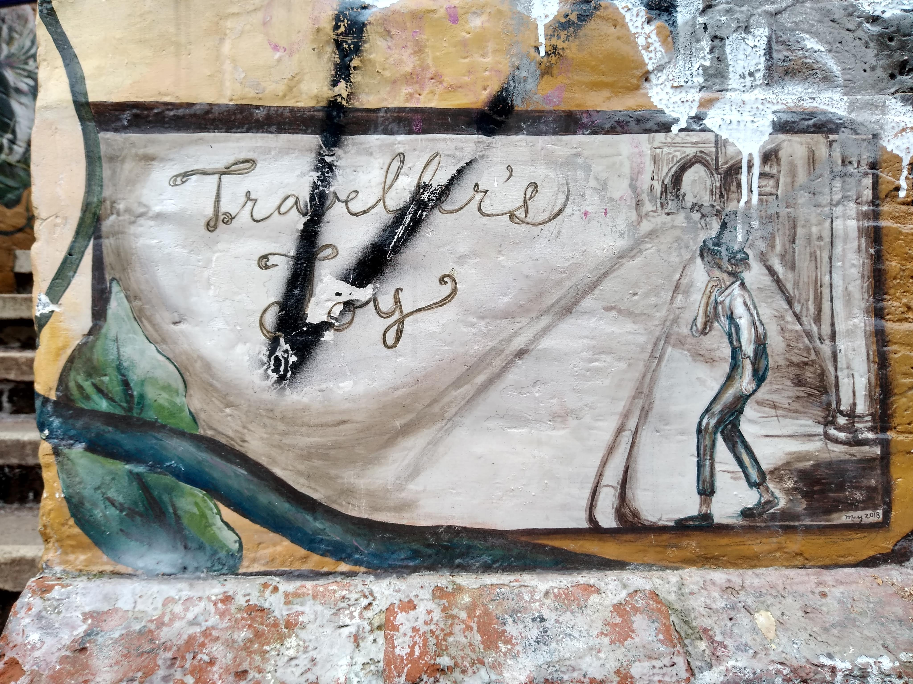
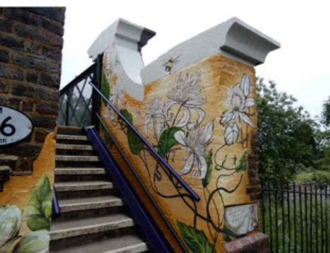

## Traveller's Joy

**Exhibition**

{: .right}

When walking around the city of Canterbury, one quickly notices the representation and referencing of the city’s rich cultural heritage. Promotional photos on shop windows, celebratory paintings in underpasses, an antiquarian bookshop named after [Geoffrey Chaucer](/14c/14c-chaucer), and even a fish and chip shop called _The Canterbury Tales_. Murals are particularly popular, in the first thought to tackle the illegal graffiti, in the second to give a new look to some of the grimmer spots in the city. Their design refers to Canterbury’s past, architecture, and historical figures, which is not surprising as the last thirty years have seen a growing enthusiasm of the wider public for local and national history.  And as Robert Hewison claims: ʹthe impulse to preserve the past is part of the impulse to preserve the self.ʹ[^ref1] 

{: .right}

In 2018 the Canterbury City Council commissioned a new mural to cover pillars of the footbridge over the railway line next to the East Station which leads from the Lansdown Road Path to Oxford Street. The requirement was to make the neglected area more appealing, welcoming to the tourists, and generating a sense of pride for the locals. The winning design from the American artist [Gloria Treseder](https://www.gtreseder.com/), studying in Canterbury in that time, accomplished this mission by choosing a different direction than the other murals – she based it around the nature and literary references native to the Kent and Canterbury region.

{: .right}

Treseder draws the inspiration for her art from nature so the central element of the mural is a plant Clematis vitalba, also called traveller’s joy, which gave its name to the mural. Its leaves and vines lead the eye to the references from literature – [Rupert Bear](/20c/20c-tourtel-biography), [David Copperfield](/dickens/david-copperfield-curated-walk/), the pilgrims from [Chaucer](/14c/14c-chaucer)'s  _The Canterbury Tales_ and finally Sherlock Holmes with Dr. Watson. Painted around them are various insects like the native English bee or the English ladybird, and silhouettes of children representing joy and playfulness. Additionally, Treseder used bright colours and illustrative, slightly expressive brush strokes.

The local audience would certainly agree that the mural showcases their heritage, but as Laurajane Smith points out: 'Heritage [is] a process of engagement, an act of communication and an act of making meaning in and for the present.'[^ref2]  It is us remembering and celebrating the following exhibits that makes them our heritage, and this mural establishes their cultural significance.

**Article written by:** Miroslava Karaskova

### References

[^ref1]: R. Hewison, The Heritage Industry: Britain in a Climate of Decline (London: Methuen, 1987), p. 43-5.   
[^ref2]: L. Smith, _Uses of Heritage_ (London: Routledge, Taylor &Francis Group, 2006), p.1.
Karaskova, M., Piesova, S. _Traveller's Joy Design - Love Where We Live Project_. 11.6.2018. https://vimeo.com/274518215.

