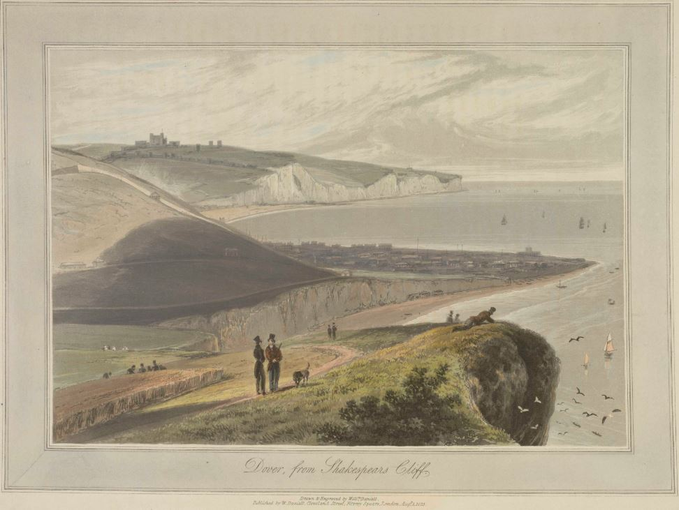

<param ve-config style="article">

## Dover in the 19th century

{: .right .dropshadow}

yle>
  .clearfix::after {content: ""; clear: both; display: table;}
</style>

# 19C Dover

  
  
<b>©The British Library Board c13874-64.</b>

Like [Ramsgate](/dickens/19c-ramsgate), Dover considered itself to be among the more genteel of the 19th century [seaside](/19c/19c-seaside) resorts. Despite sending David Copperfield down the [Dover Road](/dickens/david-copperfield-dover-road) from [Canterbury](/dickens/david-copperfield-canterbury), [Dickens](/dickens/dickens-biography) himself found the town ‘too bandy (I mean musically, no reference to its legs), and infinitely too genteel.’ But he was forced to admit that ‘the sea is very fine, and the walks are quite remarkable’.   He may well have been thinking of its famous castle and still more famous white cliffs, which remain among its most obvious attractions. As one admiring visitor put it in 1859, ‘No town in England presents a more brilliant perspective, for imposing and grand landscape.’  Other writers with a connection to the town include [Dickens](dickens-biography)'s rival [G. W. Reynolds](/19c/19c-reynoldsgwm-biography) and Matthew Arnold.

![

  
  
<b>Fort Amherst -[sic] actually Archcliff Fort ©The British Library Board maps_k_top_16_48_g](images/FortAmherst.jpg){: .right .dropshadow}
</b>

  
  
<b>Dover from Shakespeare Cliff ©The British Library Board c13874-63.</b>

The town had survived many threats over the course of centuries, but it is worth remembering that for all the historic ecstasies offered in guidebooks of the time:

The church of St Mary in 1860 experienced a narrow escape from complete destruction by the War Office, and was only with difficulty rescued by dint of urgent protests from antiquaries. One author speculated that 'The Department ... doubtless wishes all antiquaries at the devil.'1  

But as the London and Dover railway managers were keen to stress, historic churches were not the only reason to visit the town. As well as the bands so memorably deplored by [Dickens](/dickens/dickens-biography) there were amenities for the less vigorous walker in the form of ‘baths, with every accommodation for warm and sea bathing.’  

{: .right .dropshadow}

Nor did the possibilities for travel end with the offer of a few weeks at the Kent [seaside](19c-seaside). For much of the 19th century British literary culture defined itself against the purportedly ‘unhealthy’ naturalism of French novels. But that is not to say there was no traffic between the two countries – [Dickens]('dickens/dickens-biography) was one of the many travellers who embarked at Dover for prolonged trips to the continent. While ambitious plans to construct an underwater [tunnel](https://blog.nationalarchives.gov.uk/triumph-hope-evidence/) between Dover and Calais were finally abandoned in 1882,   it was of course possible to make the journey by sea, as Captain Matthew Webb proved in August 1875, when he became the first person to swim the channel.

**Article written by:** Carolyn Oulton

1. Charles Harper 276.

### Bibliography

Harper, Charles G. _The Kent Coast_. London: Chapman and Hall, 1914.  

Mackenzie, Walcott. _A Guide to the Coast of Kent, Descriptive of Scenery Historical, Legendary and Archaeological_. London: Edward Stanford, 1859.  

Author unknown. _The Illustrated Ramble Book of the London and Dover Railway_. London: J. Mead, date not given.  

Storey, Graham, Kathleen Tillotson and Nina Burgis, eds. _The Pilgrim Edition: The Letters of Charles Dickens. Volume 6: 1850-1852_. Oxford: Clarendon Press, 1988.  
<!--stackedit_data:
eyJoaXN0b3J5IjpbMTQ5MzgwNjI1MV19
-->
