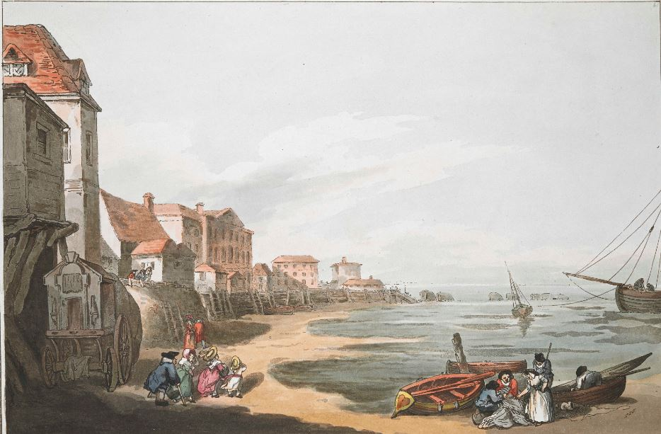

<param ve-config style="article">

## Margate in the nineteenth century

{: .right .dropshadow} align="center">
   
   

©The British Library Board maps_k_top_17_4_d

The ‘modesty hood’, designed to screen naked bathers as they descended the steps of their horse-powered bathing machines, was invented in Margate in 1753 by Benjamin Beale, and the town’s credibility as a health resort was consolidated with the founding of a charitable [Royal Sea Bathing Infirmary](http://glorious-and-unknown.co.uk/margate-royal-sea-bathing-infirmary/) in 1792 for the treatment of scrofula. In 1820 writer Walley Chamberlain Oulton noted that due to the salubrious air ‘The temperate islander may be frequently seen, at the age of ninety, performing his domestic functions with all the activity and bustle of youth.’ 

   
   

©The British Library Board c11802-06 / Maps K.Top.17.4.e.

In the early 19th century visitors would have arrived by hoy boat, although this somewhat rickety form of transport had been superseded by the steam packet by the 1830s. On arrival from London visitors landed at Jarvis’ Landing Place (erected in 1824), where they might well feel bewildered by ‘the kissings of husbands and wives, the greetings of fathers and sons, the officiousness of porters, the calls of bathing-women, the programmes of librarians, and the rush and push of the inquisitive.’[^ref1]

{: .right .dropshadow}

The light along this stretch of coast was famously applauded by the painter J. M. W. Turner, who painted a number of pictures in and of the town.

   
   

Joseph Mallord William Turner, ‘A Distant View of Margate After Sunset’, c.1840, Tate (N05239), digital image © Tate released under Creative Commons CC-BY-NC-ND (3.0 Unported).

Margate Sands railway station opened in 1846 and Margate West followed in 1863, although ironically the creation of more efficient transport links jeopardised the respectable status of the town as a [[seaside](/19c/19c-seaside)] resort by making it accessible to a lower class of visitor. As early as 1837, when [Dickens](/dickens/dickens-biographyDickens)’s Tuggs family come into money they refuse to visit the town on the grounds that there is ‘nobody there, but tradespeople.’  https://www.youtube.com/watch?v=74-HBaXX280 When [Dante and Christina Rossetti](/19c/19c-rossetti-biographyDante_Christina_Rossetti) visited Kent in 1882 in an abortive attempt to restore the former's health, they went not to Margate but to nearby Birchington.

By the end of the century Margate itself had seemingly embraced its populist reputation. The establishment of ‘Lord’ George Sanger’s [Hall by the Sea](http://glorious-and-unknown.co.uk/margate-hall-by-the-sea/) (the origin of Dreamland) https://www.youtube.com/watch?v=461nK7mazNo in the disused Margate Sands railway station in 1874 signalled an investment in entertainment for the masses, at the very time that resorts such as [Folkestone](/19c/19c-folkestone) were insisting on their exclusivity and gentility.[^ref2] 

{: .right .dropshadow} 

This ambivalence is brilliantly captured by 20th century author [Pamela Wynne](20c/20c-wynne-biography), when she sends a disdainful WW1 veteran to Margate to recover from shell shock. While the patient refers disparagingly to ‘a filthy place called Margate’  his valet remembers ‘all the trembling joy’ of his Victorian childhood holidays. ‘But as he stepped down onto the Margate platform he was majestic again. He had a position to keep up, and there would be a car to meet him.’[^ref32] 

21st century visitors are still divided on the question ['Are the arts saving Margate?'](https://www.bbc.co.uk/programmes/p07vs8sz) <param ve-video id="wizsp07vs8sz" title="Are the arts saving Margate"></var>
https://www.bbc.co.uk/programmes/p07vs8sz

 ### Bibliography

Dickens, Charles. ‘The Tuggses at Ramsgate’. Dickens’ Journalism. _Sketches by Boz and Other Early Papers 1833-39_. Ed Michael Slater. 327-344.

Oulton, Walley Chamberlain. [_A Picture of Margate and Its Vicinity_.](https://books.google.com.gh/books?id=ExEHAAAAQAAJ&printsec=frontcover#v=onepage&q&f=false) First published 1820.

Surtees, R. S. ''Jorrocks’s Jaunts and Jollities.'' London Routledge: 1838 [1869 edition]. Chapter on ‘Aquatics: Mr Jorrocks at Margate’ 113-42.

Wynne, Pamela. _Love in a Mist_. London: Philip Allen & Co., 1932.

### References

[^ref1]: Jorrocks’s Jaunts and Jollities. 124.
[^ref2]: [Canterbury Tales: from the City to the Sea.](https://www.youtube.com/watch?v=461nK7mazNo)
[^ref3]:  Love in a Mist. 101.

<!--stackedit_data:
eyJoaXN0b3J5IjpbNjI1OTM4MzU0XX0=
-->
