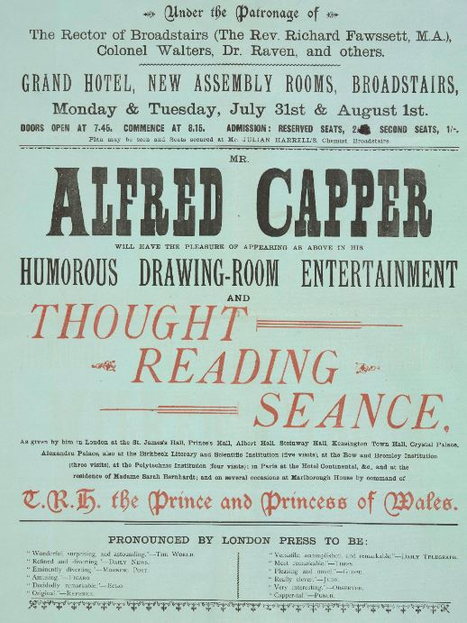

<param ve-config style="article">

## Broadstairs in the nineteenth century

{: .right .dropshadow}## Broadstairs

   
   ©The British Library Boardc13874-68 Broadstairs.

 

Despite being the favoured holiday destination of no less a figure than Charles [Dickens](dDickens-biography), [Broadstairs](https://warnerbros.digitalpigeon.com/msg/CDUQoLnGEeqC8wbfE8cnCQ/VdDOxM7Jm4sxoAAhNTQ1ZQ) never aimed to compete with either the much-vaunted gentility of Ramsgate or the mass appeal of Margate. In 1831 the teenage diarist [Emily Shore](/19c/19c-shore-biography) recorded her mother's obvious disappointment at the lack of social amenities and for most of the century it kept out less elegant tourists by the simple expedient of ‘failing to provide facilities which would attract them – no public amusements or music halls. Just a small circulating library with old-fashioned assembly room attached, calculated to attract a steady flow of quiet respectable visitors.’  One journalist commented with patronising approval in 1864 that ‘Broadstairs is a quaint old place, and its inhabitants are still very primitive.’  

{: .right .dropshadow}

An 1885 volume on ''How We Did Without Lodgings at the [Seaside](/19c/19c-seaside)" charts the successful efforts of a family in straitened circumstances to fend for themselves in a rented house in Broadstairs, a feat which the writer claims would have been impossible in a more fashionable resort such as Brighton. 

The 1880 ‘[seaside](/19c/19c-seaside) number’ of Bow Bells Novelettes did its best to liven up the holiday market with ‘The Beauty of Broadstairs’, a story about a beautiful actress, an attempted murder, a stolen will and a tearful reunion. Meanwhile the Assembly Rooms were providing accessible entertainment such as conjuring and thought reading by the last decades of the century. George and Weedon [Grossmith](/19c/19c-grossmith-biography)s' Charles Pooter – who is understandably wary of Margate - expects his family to be safe in Broadstairs at least. It is typical of the enterprising Lupin that even in this most decorous of [seaside](/19c/19c-seaside) resorts he quickly discovers the appearance of Polly Presswell, ‘England’s Particular Spark’, at the Assembly Rooms.

{: .right .dropshadow}668 Images Online.

   
  Alfred Capper ©The British Library Board c02908-08 / Evan.2795.

But overall the image of the town remained decorous even in the tempestuous 1890s. Israel Zangwill captured the mood perfectly in a comic account of:

>    a jolly old waterman, who paddles about apparently to pick up exhausted bathers. One morning as I was swimming past his boat he warned me 
    back. “Any danger?” I asked. “Ladies,” he replied, ambiguously enough. It thus transpired that his function is to preserve a scientific 
    frontier between the sexes.’  

The next year in 1897 the Broadstairs Pier and Harbour Commissioners complained that bye laws were being flagrantly disregarded and that one man bathing  only in a ‘clout’ (a loosely tied piece of cloth) had been approached by an official, ‘whereupon the gentleman’s wife told her husband to knock him down for meddling’. The meeting noted that ‘while mixed bathing might be favoured at a place like Margate’ (which it was not, incidentally)  ’they wanted to keep Broadstairs select’.

Feeling active? You may want to try this [Turner and Dickens walk]( https://explorekent.org/activities/turner-dickens-walk/)

## Article written by 
Professor Carolyn Oulton

## Bibliography

Dicks, John. The Beauty of Broadstairs. Bow Bells Novelettes. _Seaside number_ (82). Vol iv.  
August 1880. 113-28.

Grandfield, Yvette F. ‘The development of the seaside resort and the striving for `social tone', 1850-1899, with a particular examination of Margate and Folkestone : dissertation submitted in part fulfilment of the requirements for the degree of Master of Arts of the University of Kent at Canterbury’. (1994).

Grossmith, George and Weedon. _The Diary of a Nobody_. First published 1892.

Unattributed. How We Did Without Lodgings at the Seaside, Saved Our Money and Doubled 
Our Pleasure. By the author of How We Managed Without Servants. [Reprint] London: 
Griffith, Farran, Okeden & Welsh, 1885.

Unattributed. ‘Shrove Tuesday at Broadstairs’. _Penny Illustrated Weekly News_.  February 1864. 566. British Newspaper Archive.
<!--stackedit_data:
eyJoaXN0b3J5IjpbMTI1OTY0MjU3M119
-->
