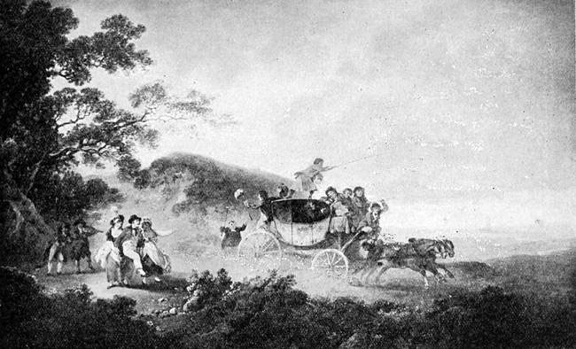
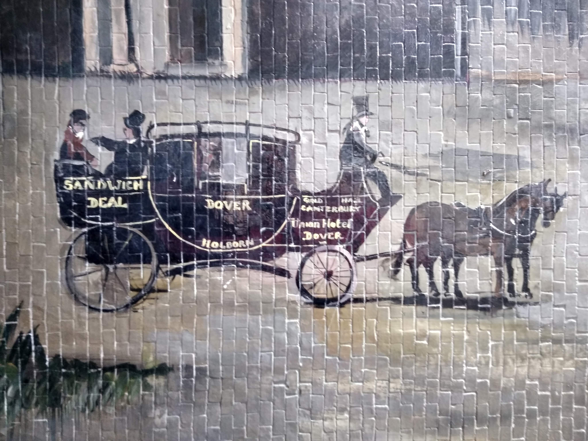

## Dickens, A Tale of Two Cities and France

>“It was the best of times, it was the worst of times…” (Dickens, 1875, p.1)

{: .right}

The opening of [Charles Dickens](/dickens/dickens-biography)’ novel _A Tale of Two Cities_, is probably one of the most famous in English literature. Set in London and Paris, the novel sets out the events leading up to, at the start of, and even predicts the end of the French Revolution. It was written on the top floor of Dicken's [Swiss chalet](dickens/dickens-swiss-chalet) during the spring and summer at his [Gad's Hill](/dickens/dickens-gads-hill) home, and published just three years after he had moved to Kent.

The action in the novel very quickly moves to the county, with the Mail coach arriving at [Dover](/dickens/dickens-dover) at six a.m., having set off from London at eight the previous evening.  Dickens’ description of the postal service is consistent with contemporary accounts and the passengers’ unwillingness to trust one another seems to reflect the dangerous nature of journeys reported in news articles from 1775, of robberies where highwaymen stopped coaches on their way into towns.[^ref6] 

The journey between Dover and London was a fairly popular one, which meant coaches made the journey everyday excepting Sundays.[^ref7] In Dickens’ description of the journey near Shooters Hill, however, it does not sound like a pleasant one:

{: .right}

>He walked uphill in the mire by the side of the mail […] because the hill, and the harness, and the mud, and the mail were all so heavy, that the horses had three times already come to a stop, besides once drawing the coach across the road, with the mutinous intent of taking it back to Blackheath […] There was a steaming mist in all the hollows, and it had roamed in its forlornness up the hill, like an evil spirit, seeking rest and finding none. A clammy and intensely cold mist, it made its slow way through the air in ripples that visibly followed and overspread one another, as the waves of an unwholesome sea might do.[^ref8] 

Dickens adds that such a journey in winter was “an achievement to congratulate an adventurous traveller upon”[^ref9] and even the condition of the coach was not something that would add comfort to such a journey, “The mildewy inside of the coach, with its damp and dirty straw, its disagreeable smell, and its obscurity, was rather like a larger dog-kennel”.[^ref10]

In the novel, Jarvis Lorry, who had made the perilous journey From London, takes a walk long the beach at [Dover](/dickens/dickens-dover): 
  
>The little, narrow, crooked town […] hid itself away from the beach, and ran its head into the chalk cliffs, like a marine ostrich. The beach was a desert of heaps of sea and stones tumbling wildly about, and the sea did what it liked, and what it liked was destruction. It […] thundered at the cliffs, and brought the coast down, madly. The air among the houses was of so strong a piscatory flavour […]. A little fishing was done in the port, and a quantity of strolling about by night… [^ref2]

{: .right}

This is one of only a few references to [Dover](/dickens/dickens-dover). But Dickens does make reference to the Royal George Hotel where Mr Lorry stays before he leaves England. Jervis Lorry's stay sounds a comfortable one, even if the hotel's decor was a little funereal, as he enjoyed a bottle of claret by the fire. The real-life equivalent of this hotel is believed by some to be the Ship Hotel which was sadly demolished the year after Dickens published _A Tale of Two Cities_.[^ref3] Dickens stayed in this hotel in 1856 and this hotel was also frequented by other literati such as Lord Byron.[^ref4] For a time, this hotel bore a name slightly more similar to the one Dickens chose, when it was known as The Royal Ship Hotel.[^ref5] 

_A Tale of Two Cities_ is not the only Dickens's novel to include the treacherous journey along the [Dover Road](/dickens/david-copperfield-dover-road/). Both [David Copperfield](dickens/david-copperfield-curated-walk) and _Little Dorrit_ (1856) include unfavourable accounts of the journey.  

>Next morning’s sun saw Mr Dorrit’s equipage upon the Dover road, where every red-jacketed postilion was the sign of a cruel house, established for the unmerciful plundering of travellers. The whole business of the human race, between London and Dover, being spoliation, Mr Dorrit was waylaid at Dartford, pillaged at Gravesend, rifled at Rochester, fleeced at Sittingbourne, and sacked at Canterbury. However, it being the Courier’s business to get him out of the hands of the banditti, the Courier brought him off at every stage; and so the red-jackets went gleaming merrily along the spring landscape, rising and falling to a regular measure, between Mr Dorrit in his snug corner and the next chalky rise in the dusty highway.

It is clear that Dickens was writing from first-hand experience as he was a frequent visitor to France, a country he loved dearly. In a letter to Emile de la Rue in 1847 he described the French to be "the first people in the universe"[^ref1]. However, despite his love of the French, _A Tale of Two Cities_, was not very popular in France, and there are fewer French translations than his other works. Some suppose that the book is misunderstood in translation. The title of the first translation _Paris et Londres en 1793_  (Paris and London in 1793)[^ref1], seems to miss the point, ignoring the novel's start date of 1775, and this may account for its lack of popularity. 

By 1865, Dickens was travelling to and from France by boat train via the more fashionable neighbouring town of [Folkestone](/19c/19c-folkestone). It is on one of these journeys that he was involved in the [Staplehurst](dickens/dickens-staplehurst/) rail crash, proving that rail journeys, although more comfortable could be as perilous.

### Bibliography

Biography.com (2020) _Charles Dickens Biography_. Available at: https://www.biography.com/writer/charles-dickens (Accessed: 3 February 2021).   
Birmingham, J. (1853) 'The Royal Ship Hotel Dover', _The South Eastern Gazette_, 4 October, p.8.   
Daily Advertiser (1775) 'News', 3 January, p.1   
Dickens, C. (1875) _A Tale of Two Cities_. Facsimile. London: GE Fabbri Publishing Ltd., 2003.   
Edmondson, J. (ed.) (2006) _Dickens on France: Fiction, Journalism and Travel Writing_. Oxford: Signal Books Limited.   
MacCarthy, F. (2014) _Byron: Life and Legend_. London: John Murray Press.     
Jones, C., McDonagh, J. and Mee, J. (ed.) (2009). _Charles Dickens, A Tale of Two Cities, and the French Revolution_. Basingstoke: Palgrave Macmillan.   
Legendary Trips (2021) _ Tale of Two Cities by Charles Dickens: a map of all the places in France and England._ Available at: https://www.legendarytrips.com/trip/a-tale-of-two-cities-dickens-map-places/#shiphotel(demolished),dover,england (Accessed: 27 January 2021).
M, M. (2012) 'A Tale of Two Cities - Charles Dickens', _Lit Nerd Around the World, 29 October_. Available at: http://litnerdaroundtheworld.blogspot.com/2012/10/a-tale-of-two-cities-charles-dickens.html (Accessed: 3 February 2021).
Pigot, J. (1824) _Pigot’s Directory of Kent, 1824_. Available at: http://specialcollections.le.ac.uk/digital/collection/p16445coll4/id/167102 (Accessed: 28 January 2021).
Storey, G. and Fielding, K.J. (1981) _The Letters of Charles Dickens_. vol.V. Oxford: Clarendon Press, 1981, p. 42.
Tomalin, C. (2012) _Charles Dickens: A Life._ London: Penguin Books.   
Whyman, John. _Kentish Sources: The Early Kentish Seaside_. 1985. Kent Archives Office, Gloucester. Alan Sutton Publishing Limited. p.33.   

### References

[ref1:] (Storey, G. and Fielding, K.J., 42).
[^ref1]: (Jones, McDonagh, and Mee, 2009).  
[^ref2]:  (Dickens, 1875, p.20).   
[^ref3]:  (Legendary Trips, 2021).   
[^ref4]:(MacCarthy, 2014, ch.17).   
[^ref5]:  (Birmingham, 1853).  
[^ref6]:  (Daily Advertiser, 1775, p.1).  
[^ref7]:  (Whyman, 1985, p.33).  
[^ref8]:  (Dickens, 1875, pp.5-6).  
[^ref9]:  (Dickens, 1875, p.17).  
[^ref10]:  Ibid.  

