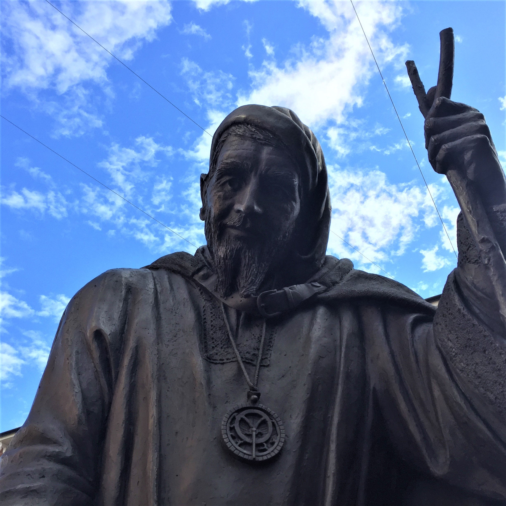

<param ve-config style="article">

## Geoffrey Chaucer c.1340s-1400

**Places:** Woolwich, Combe, Canterbury

>And specially, from every shires ende
Of Engelonde, to Canterbury they wende,
The holy blisful martir for to seeke,
That them hath holpen whan that they were seeke.
 _Chaucer's Prologue_

{: .right .dropshadow}

It is generally believed that Geoffrey Chaucer was born in the early 1340s, as in October 1386 he testified in the trial of Scrope v Grosvenor, claiming to be “forty and more” years old at the time. However, neither his exact place nor year of birth are known. Brought up in a family of prosperous wool and wine merchants, Chaucer has become one of England’s most famous poets.

He is best known for _The Canterbury Tales_, which he wrote in the last decade of his life.  The Tales are a collection of stories told by a group of pilgrims travelling to Canterbury to visit the Shrine of Thomas Becket. The pilgrims only made it as far as Harbledown,  Whether Chaucer visited Canterbury himself is uncertain, although Robert Foreville believes that Chaucer may have visited during the 150-year jubilee of Becket's reburial in the Trinity Chapel.

Chaucer’s interest in Kent dates back to around 1375. In 1385 he was given permission to employ deputies for the roles of controllers of wool and petty customs for the London port, perhaps because of his involvement in Kent. He was named a “member of the commission of the peace” on the 12th of October of the same year, as such he likely already had financial commitments in the area by this time, the role was renewed in 1386 . In October 1386 he was elected “Knight of the Shire” to represent Kent in the wonderful parliament from 1 October to 18 November 1386. He was also a Justice of the Peace until 1389 dealing with crimes revolving round trespassing, ambushes and weights and measures violations. However, for the most part Chaucer’s activity in the county is limited. He witnessed documents such as in Woolwich, May 1393; February 1395 in Combe; and at Combe again March and April 1396, regarding a premises in Spittalcombe. 

After Chaucer resigned from his role as “Clerk of the King’s Works” in 1391, he seems to have had some financial problems. His retirement in Kent could have provided access to different resources as well as distancing him from any reaction from the king for having quit his royal appointment.

**Article written by:** Charli Worthington
