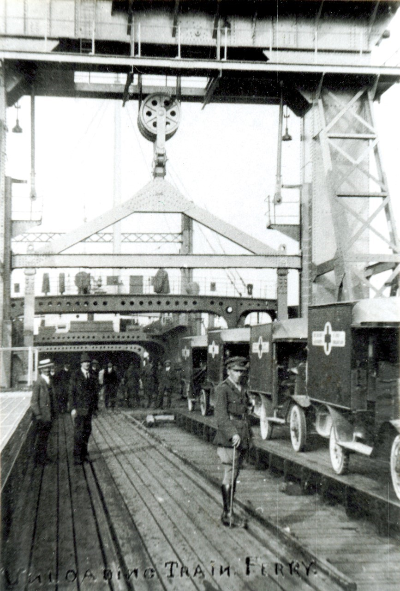

<param ve-config style="article">

## Richborough: the Secret Port

{: .right .dropshadow}

The battle of the Somme in the summer of 1916 demonstrated just how attritional and industrialised the war on the Western Front had become, with hundreds of thousands of human casualties accompanied by an unprecedented consumption of material. With nearly 2 million men in the field, the British and imperial army required a staggering amount of supplies just for daily living, and that was before the stockpiling of weapons and ammunition in preparation for yet another offensive. With the military ports of [Folkestone]( 20c-folkestone-ww1) and Southampton at capacity, the government had to develop another port to ensure the availability of sufficient manpower and machinery of war to defeat the German army.

The old Roman port of Richborough, at the mouth of the Wantsum channel, was chosen for development because it had two advantages. Firstly, the port was hidden away from the main cross channel routes and, due to heavy silting, it was judged that the Germans would not think it was a suitable location for reconnoitre. Secondly, the site was clear and situated only a half-mile from the main railway line linking Kent to the rest of the country; a gap that could be closed in a very short time. The decision made, construction moved at speed, creating what was virtually a self-sufficient new town that could house up to 20,000 servicemen and civilians, with its own power station, hospital, and 24-hour canteen. The establishment of the latter led to the formation of the Army Catering Corps. 

{: .right .dropshadow}

This infrastructure supported the newly constructed barge building work, including a foundry and other plant to turn raw materials into the finished product, internal railway system (linked to the mainline) and the revolutionary Roll – On Roll Off ferry terminal. Production at Richborough was focused on barge building so that these could be loaded with hundreds of tons of war material and towed over the English Channel to the excellent French inland waterways system. As this operation got under way, the government ordered, from private shipbuilders, 4 new Ro-Ro train ferries which were built and delivered in less than 12 months. With the construction of a purpose-built link, adjusting the height of the road and rail way to the height of the ferry on the tide, both vehicles and trains could drive straight on – hence Ro-RO.  Consequently, these vessels could be turned around in twenty minutes, significantly increasing the rate of supply. Returning from France the ferries carried trains and road vehicles carrying the wounded as well as the salvage and scrap from the front. 600 local women were employed to sort out the scrap metal at night, which was then sent by train to Birmingham for recycling.  Richborough played a vital part in supplying the army for its ‘last stand’ at Amiens in the spring of 1918, and for the final one-hundred-day offensive that brought about the defeat of the German Army.

Built in secret, the port was demolished in 1919 and, despite attempts at a commercial revival in the 1920s, the silt problem defeated all comers, and there remain just a few reminders of what was once a vital part of the war effort in 1918.

**Article written by:** Dr Martin Watts

