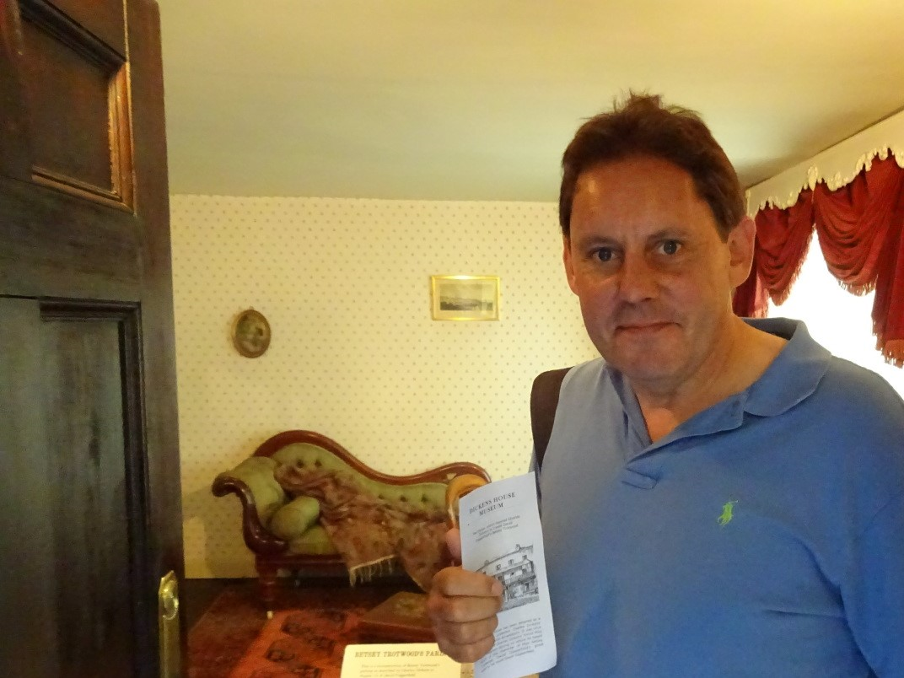

<param ve-config title="Kent Maps Dickens Project: About">

## About the site and project

This site is the product of a collaboration between [JSTOR Labs](https://labs.jstor.org) and a team led by Carolyn Oulton, Professor of Victorian Literature in the School of Humanities, Canterbury Christ Church University.

The site provides a set of themed essays about Kent, a county in South East England.  Kent has a rich history and provided inspiration for a number of writers and artists including Charles Dickens, who is featured in the early essays available on the site.

The JSTOR Labs team is providing tools and infrastructure for presenting the essays with interactive visualizations that are generated from annotations inserted in the text by the essay authors.  The visualizations include interactive maps with feature overlays that provide context for associated paragraphs in the essay. Much of the data used in the contextualized visualizations is obtained from open access knowledge graphs such as [Wikidata](https://www.wikidata.org), the primary data source behind Wikipedia.

Framed by the idea of ‘writers and their times’, the project is researching historic, literary and geographical records to create an interactive experience seen through multi-disciplinary lenses. This approach contextualises literature and textual records of historic events through an emphasis on the material conditions in which they were produced and circulated. 

But rather than simply recreating a historic experience, the research aims to problematise the ways in which we interpret and represent the past. What do we think we know about the history of local landscapes? How do conflicting perspectives and gaps in the record remind us that representation is always selective and that _history_ is just that – a story we tell to others and ourselves?

As the map grows so too will the capacity for making unforeseen connections. While the project inevitably reflects the interests of the research team, it is highly collaborative and is not designed to showcase or privilege any one argument over another. Instead it will help you find your own answers to questions you haven’t thought of yet.

## About the collaborators

### Carolyn Oulton

Carolyn Oulton is Professor of Victorian Literature and Director of the International Centre for Victorian Women Writers at Canterbury Christ Church University, where she also teaches on the Creative and Professional Writing BA. Her research interests include seaside literary heritage and the culture of shared reading. While carrying out research in Dickens Land she infringed enough bye laws to get herself hanged under the Bloody Code. But it was all Pip’s fault.

### Ken Moffat

Ken Moffat is Headteacher of Simon Langton Boys’ Grammar School in Canterbury.

### Michelle Crowther

Michelle Crowther is the Learning and Research Librarian for the School of Humanities at Canterbury Christ Church University. When she's not teaching students how to search 19th century periodicals, marking hyptertext up and down, or chasing Dickens around a virtual map, she is doing a PhD in Victorian literature.

### Elizabeth Waterman-Scrase

Elizabeth Waterman-Scrase is a writer, historian, and experimental surrealist. She has spent almost 30 years rummaging about in museums and castles across the UK and Europe researching the human story, following the footsteps of our collective history. Elizabeth has taught history across Europe, built siege engines, cannons, and been shot with an arrow (it was believed to be an accident). As of 2016, Elizabeth has been studying at Canterbury Christ Church University, completing her BA (Hons) in Creative and Professional Writing. Elizabeth is now onto her Masters in Creative Writing and heading towards the study of a Ph.D.

### JSTOR Labs

