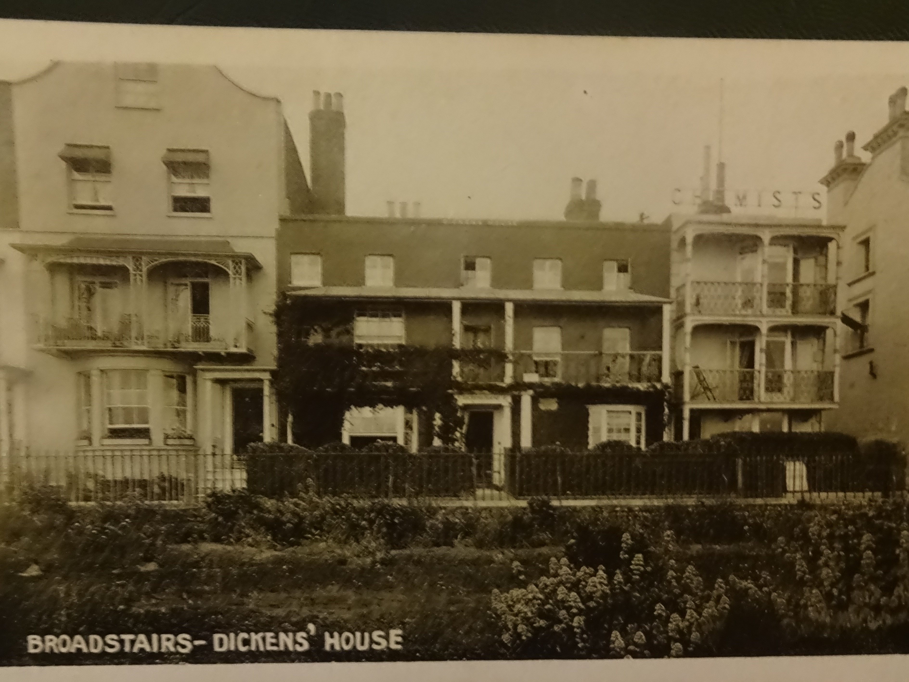

<param ve-config style="article">

## 2 Nuckell’s Place, Victoria Parade, Broadstairs. 

**The model for Betsey Trotwood’s cottage in David Copperfield.**

**Publication** _David Copperfield_ (1848-50).

>‘I followed the young woman, and we soon came to a very neat little cottage with cheerful bow-windows: in front of it, a small square gravelled court or garden full of flowers, carefully tended, and smelling deliciously.
“This is Miss Trotwood’s” said the young woman. “Now you know; and that’s all I have got to say.” With which words she hurried into the house, as if to shake off the responsibility of my appearance; and left me standing at the garden-gate, looking disconsolately over the top of it towards the parlor-window, where a muslin curtain partly undrawn in the middle, a large round green screen or fan fastened on to the window-sill, a small table, and a great chair, suggested to me that my aunt might be at that moment seated in awful state.’
_David Copperfield_.

{: .right .dropshadow}

Aunt Betsey’s cottage in _David Copperfield_ (1848-50) was inspired by 2 Nuckell’s Place, Victoria Parade, although understandably this did not deter several generations of literary pilgrims from searching for the original in [Dover](/dickens/dickens-dover), where David claims to have taken refuge with his aunt. Dickens was staying nearby at [Fort House](/dickens/dickens-fort-house) in the summer of 1849, when he wrote the chapter in which David is mistaken for a beggar by the mistrustful Janet, before being taken in by his remorseful Aunt Betsey. In the mid-1890s the cottage was renamed Dickens House in recognition of its literary significance. Fittingly it later became the home of twentieth century novelist and dramatist [Gladys Waterer](/20c/20c-waterer-biography). One of the organisers of the inaugural [Broadstairs](dickens-broadstairs) Dickens Festival in 1837 and an active member of the Dickens Fellowship, Waterer adapted scenes from a different Dickens novel each year (using two live donkeys for the 1938 adaptation of _David Copperfield_). However she confessed in 1964 that she had never tried her hand at Oliver Twist because ‘I couldn’t bear to spend eight months with those people’. On her death in 1973 Dickens House became the [Dickens Museum](https://www.thanet.gov.uk/info-pages/dickens-house-museum/) and ‘Betsey’s parlour’ has been meticulously recreated from David’s description.

See also [David Copperfield: a curated walk](/dickens/david-copperfield-curated-walk)

**Article written by:** Ken Moffat and Carolyn Oulton

## Bibliography
Dickens, Charles. _David Copperfield_. Oxford: Oxford World’s Classics 1999.  

‘Gladys Waterer Talks Dickens at Broadstairs’. _Illustrated London News_. 4 April 1964. 90.
