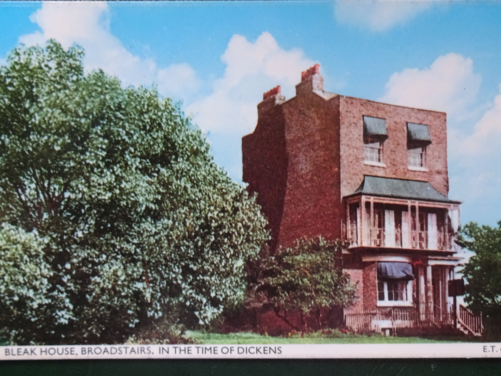

<param ve-config style="article">

## Fort House (Bleak House)
*Fort Road, Broadstairs*

{: .right .dropshadow}

**Event with dates** Holidays in 1837, 1840-43, 1845, 1847, 1849-51; parts of _David Copperfield_ written here.

**Publications of local interest** _David Copperfield_ (1848-50), 'Our Watering Place' (1851).

>We have a pier – a queer old wooden pier, fortunately without the slightest pretensions to architecture, and very picturesque in consequence. Boats are hauled up upon it, ropes are coiled all over it; lobster-pots, nets, masts, oars, spars, sails, ballast, and rickety capstans, make a perfect labyrinth of it. For ever hovering about this pier, with their hands in their pockets, or leaning over the rough bulwark it opposes to the sea, gazing through telescopes which they carry about in the same profound receptacles, are the Boatmen of our watering-place. … These are among the bravest and most skilful mariners that exist. Let a gale arise and swell into a storm, let a sea run that might appal the stoutest heart that ever beat, let the Light-boat on these dangerous sands throw up a rocket in the night, or let them hear through the angry roar the signal-guns of a ship in distress, and these men spring up into activity so dauntless, so valiant, and heroic, that the world cannot surpass it.
‘Our Watering Place’. _Household Words_ 1851.

[Fort House](/dickens/dicken

   
  ‘Bleak House’ (Fort House) as Dickens would have known it. ©Elgate Postcards, Margate.

   
  Early 20C postcard of Bleak House (formerly Fort House)

[Fort House](s-fort-house) in Fort Road, like Dickens House ([2 Nuckell's Place](/dickens/david-copperfield-nuckells-place)) was the source of considerable confusion both during and after Dickens’s lifetime. It was his '''holiday''' house of choice in [Broadstairs](/dickens/-broadstairs) for many years and it was here that he entertained a succession of literary and artist friends including the novelist Wilkie Collins. Parts of _David Copperfield_ were written here, including the ending. 

{: .right .dropshadow}

By 1864 it was sometimes informally known as Bleak House, leading many visitors to assume that this novel too had been written in the town. But the name was formally changed to Bleak House only after Dickens’s death (somewhere between 1879  and 1885).

The original name seems an obvious choice based on the striking appearance of the house as it is today, but ironically in Dickens’s day there was nothing fort-like about it. Dickens scholar Frederick Kitton visited the house in 1889 and was horrified when a later owner ‘thought fit to restore, alter and extend the premises, converting the building into a pretentious-looking mansion of Tudor design, with castellated eaves and other “improvements,” by which it is changed beyond all recognition.’[^ref1]

This creative confusion of different novels with the houses associated with Dickens is characteristic of the town’s history. In 1897 a precursor of the Dickens Festival saw Broadstairs transformed into a ‘Dickens Village’, complete with costumed figures and buildings such as Peggotty’s boat (from the Suffolk scenes of _David Copperfield_) and Defarge’s wine shop from _A Tale of Two Cities_ (Again, Paris is chosen over the [Dover Road](dickens/david-copperfield-dover-road) for representation). During the festival visitors were given a chance to make a tour of Bleak House. One journalist noted with amusement that ‘On one side of the panels of the nursery door is daubed a garish sprawling spray of apple-blossom. Above it is inscribed by a sacrilegious pencil, “Fillia de Carolus hoc tecit’(done by the daughter of Charles).[^ref2]

**Article written by:** Professor Carolyn Oulton

   
  Childe Hassam, 'Bleak House, Broadstairs'. 1889. Collection of the Canton Museum of Art, Purchased by the Canton Museum of Art, 2017.83

### Bibliography

Kitton, Frederick G. _The Dickens Country_. London: A. C. Black, 1925 [first published 1905].

### References

[^ref1]: Kitton (195-6).

[^ref2]: 'A Dickens Village at Broadstairs. In Memory of the Great Novelist’. _Pall Mall Gazette_. 8 June 1897. 7. British Newspaper Archive.
<!--stackedit_data:
eyJoaXN0b3J5IjpbMTAxNzcyMDA4XX0=
-->