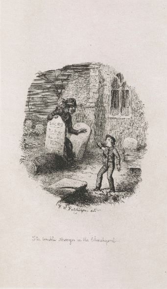

<param ve-config style="article">

## Cooling 

>‘Ours was the marsh country, down by the river, within, as the river wound, twenty miles of the sea. My first most vivid and broad impression of the identity of things, seems to me to have been gained on a memorable raw afternoon towards evening. At such a time I found out for certain, that this bleak place overgrown with nettles was the churchyard; and that Philip Pirrip, late of this parish, and also Georgiana wife of the above, were dead and buried; and that Alexander, Bartholomew, Abraham, Tobias, and Roger, infant children of the aforesaid, were also dead and buried; and that the dark flat wilderness beyond the churchyard, intersected with dykes and mounds and gates, with scattered cattle feeding on it, was the marshes; and that the low leaden line beyond, was the river; and that the distant savage lair from which the wind was rushing, was the sea; and that the small bundle of shivers growing afraid of it all and beginning to cry, was Pip.’ _Great Expectations_.

In the opening scene of [_Great Expectations_](great-expectations-curated-walk) (published in 1861 but apparently set around the 1820s), a young Pip is famously terrified by a convict in leg irons while visiting the grave of his parents and five siblings. In fact the ‘five little stone lozenges’ recalled by Pip are derived from thirteen gravestones in the thirteenth century St James’s Church, Cooling, and appertain to two separate families. Nonetheless the church’s website notes that the children’s graves referenced in the novel are ‘now inevitably referred to as ''Pip's graves.'' St Mary’s, Higham, from which it is possible to see a beacon, a gibbet and a battery, has been suggested as an additional model.[<^ref1]>

{: .right .dropshadow}

   
  Cooling

©The British Library Board ktc28b20f001r.
©The British Library Board. ktc28b20f002r 

Visiting St James’s where the graves are located, it is easy to imagine how vulnerable a child in this position would feel. A few feet away the church porch invites him to seek a legalised sanctuary that is just out of reach, while his parents’ inability to protect him is ironically registered through their physical presence – one of the most uncomfortable moments is the convict’s expression of relief at hearing they are dead, and at one point Pip is literally made to sit on their tombstone. Given the darkness of this imagining, it is extraordinary to think that Dickens brought family and friends to picnic here.

To the child brought up to believe unquestioningly in adult authority, the convict’s threat that his confederate can infiltrate the home itself is intensely real. Even when Pip is duly sent home to find ‘wittles’ and a file, he knows that he can be kept under surveillance for miles as he moves through ‘dykes and mounds and gates’ with only the ‘scattered cattle’ to witness his terror.
The full tragedy of the scenario may strike an adult – reading this passage in the church porch on a damp day, the hopelessness of Magwitch’s plight resonates in his very speech, despite his initial treatment of Pip. To look out across the ‘dark flat wilderness beyond the churchyard’ on such a day is to realise that there is no shelter for either child or convict. By the time he tells his story the narrating Pip is deeply conscious of this. But as his reticence on this point reminds us, it is here that the child first learns what it means to keep a guilty secret. 

See also [Mobile Landscapes](/dickens/mobile-landscapes)

Feeling active? You may want to try this [Heron Cycle Trail](https://explorekent.org/activities/heron-cycle-trail-the-hoo-peninsula/)

**Article written by:** Ken Moffat and Carolyn Oulton

## Bibliography.

Dickens, Charles. _Great Expectations_. Oxford: Oxford World’s Classics, 1993.

[About St James' Church]( http://coolingchurch.org.uk/about/). Accessed 28 November 2018.

Shlicke, Paul, ed. _The Oxford Companion to Charles Dickens: Anniversary edition_. Oxford: Oxford University Press, 2011.

### References

[<^ref1]>: Shlicke 319.
<!--stackedit_data:
eyJoaXN0b3J5IjpbMTQ2MzM2NDA3N119
-->