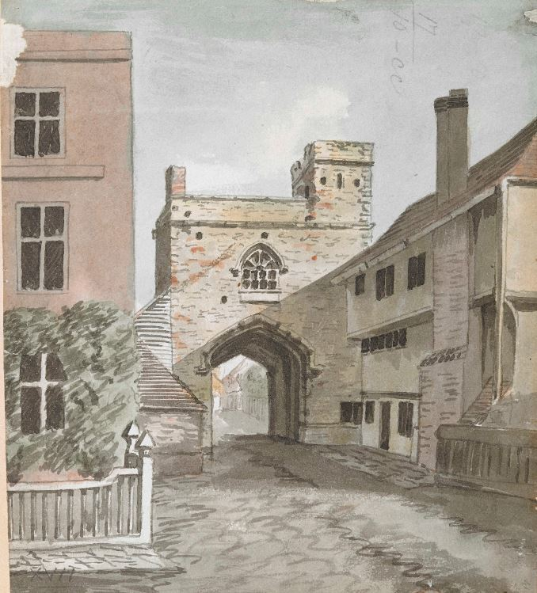

<param ve-config title="Kent"
       banner="/images/kent-map-header.jpg"
       layout="index">

# Kent maps

This site is the product of a collaboration between [JSTOR Labs](https://labs.jstor.org) and a team led by Carolyn Oulton, Professor of Victorian Literature in the School of Humanities, Canterbury Christ Church University.

The site provides a set of themed essays about Kent, a county in South East England.  Kent has a rich history and provided inspiration for a number of writers and artists including Charles Dickens, who is featured in the early essays available on the site.

# Featured essays

##
[**Mobile Landscapes**](/dickens/mobile-landscapes)

- author: Ken Moffat and Carolyn W. de la L. Oulton

You’ll need a map because there are no signposts. There are witnesses of course, hundreds of them queueing up to tell you that they are the original Aunt Betsey, or Broadstairs fisherman, or Janet, or how sorry they are now for stealing that pie. They are not all to be trusted. And don’t be fooled by the first ‘Pickwick Pub’ or ‘Pip’s Inn’ you see. There are many places to stop and refresh yourself on the way. And you will need refreshments, this is going to be tiring work.

##
[**Great Expectations - A curated walk**](/dickens/great-expectations-curated-walk)

- author: Ken Moffat and Carolyn W. de la L. Oulton

The landscape Pip describes seems to alter as he moves across it. In his nightmarish journey across the marshes to take provisions to Magwitch in Chapter 3 the finger post is all but invisible in the mist until it presents itself as ‘a phantom devoting me to the Hulks’. Gates, dykes and banks come ‘bursting’ at him and in his terror, he finds himself explaining his conduct to a curious ox.

##
[**David Copperfield - A curated walk**](/dickens/david-copperfield-curated-walk)

- author: Ken Moffat and Carolyn W. de la L. Oulton

David Copperfield, like Pip in _Great Expectations_, shares the difficult story of what it means to become involuntarily fascinated, even obsessed: with grotesque figures, with landscapes, with the secrets of one’s own past. From the moment of meeting the chilling Mr Murdstone the child David finds it hard to take his eyes off him, and he will later find himself compelled to watch the slumbers of Uriah Heep, as he succumbs to what Dickens memorably termed ‘the fascination of repulsion’. In both cases David emphasises the way in which his home is invaded by these unwelcome figures. But just what home means – and where it is – proves elusive throughout the novel.

# Essays by period or theme

##
[**Dickens**](/dickens)

One of the greatest Victorian novelists, Charles Dickens lived in Kent from 1816 to 1822; and again from 1856 to 1870.

##
[**16th century**](/16c)

Establishment of Chatham Dockyard. Battle against the Spanish Armada. Industry includes textiles and iron production.

##
[**17th century**](/17c)

Industry includes production of malt for brewing. Civil Wars.

##
[**18th century**](/18c)

Strategic position of the Medway in relation to European wars. New sea water ‘cures’ see the reinvention of Margate as a fashionable resort.

##
[**19th century**](/19c)

Arrival of the railway. Development of recognisably modern tourist industry.

##
[**20th century**](/20c)

Dover and Folkestone become the gateway to the Western Front during WW1. Seaside towns decline, challenged by the increasing popularity of overseas holidays.

##
[**21st century**](/coming)

Regeneration and the rise of the DFL.
